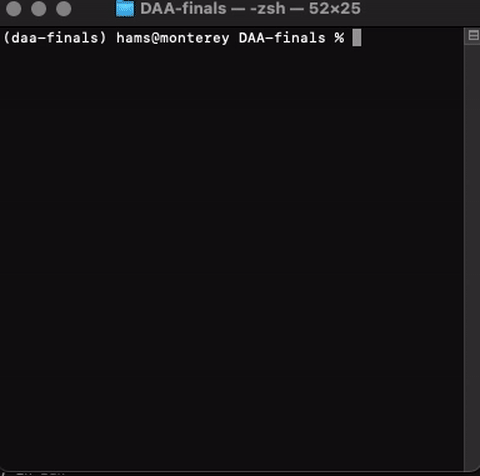
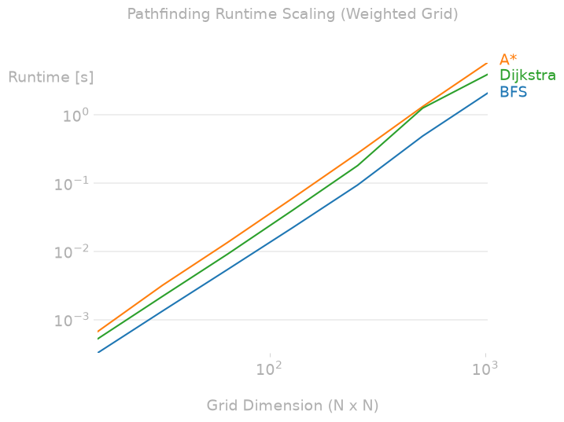
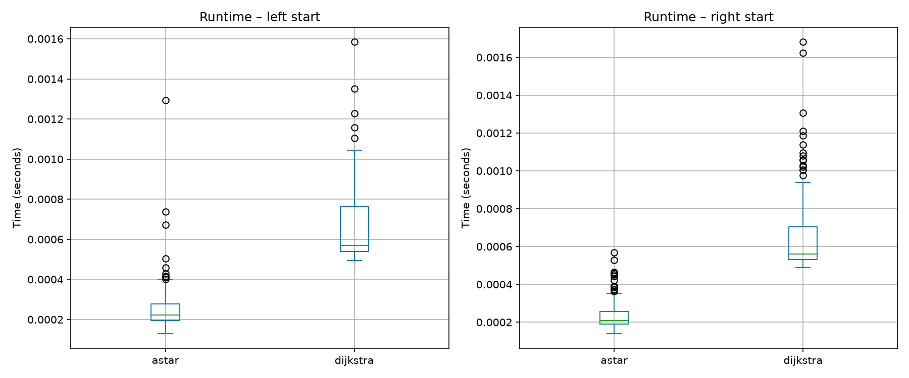
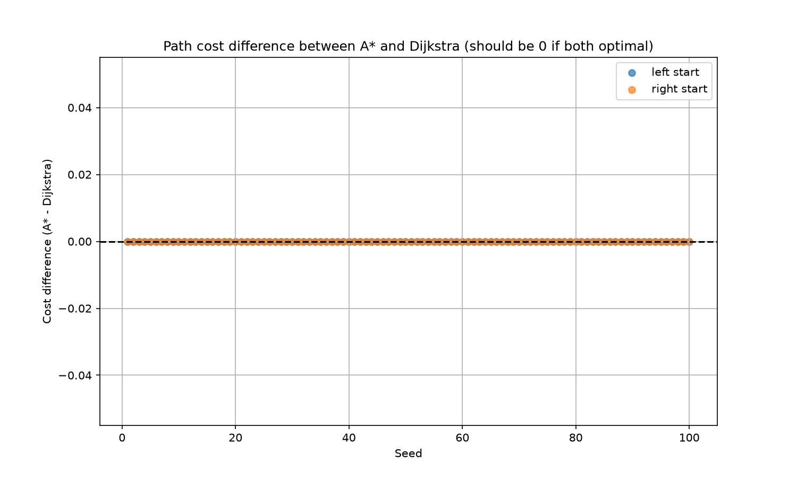

# DAA Finals

| NRP | Name | Class | GitHub |
| --- | ---- | ----- | ------ |
| 5025241107 | Muhammad Zahran Rizki Prinanda | G | [@Akahazu](https://github.com/Akahazu) |
| 5025241152 | Bintang Ilham Pabeta | E | [@ilhmpbta](https://github.com/ilhmpbta) |
| 5025241162 | Felix Aldorino | F | [@NewGenome](https://github.com/NewGenome) |

# Restaurant 67 - Debug Version

An experimental version of the current game (made by the same team) in order to test multiple scenario regarding pathfinding algorithm problems with randomized cost in the same map. These includes the visualization of the path cost, the lines that shows the pathfinding algorithm in action, and the configurable map seed & algorithm.

The main difference lies in the removal of the gamification aspect of the game, focusing solely on the pathfinding algorithm problems (This is basically an extension of the real application).

## Gameplay

The real application can be accessed in [@Akahazu/Quiz2DAA](https://github.com/Akahazu/Quiz2DAA)



> Note that there are lines with the corresponding enemy color that show the pathfinding algorithm in action.


## Installation & Setup

Ensure you have Python 3.x installed on your system.

1. **Clone the repository:**

      ```bash
      git clone https://github.com/ilhmpbta/DAA-finals
      cd DAA-finals
      ```

2. **Install Dependencies**

      ```bash
      pip install uv
      uv sync
      ```

3. **Run the game**

      ```bash
      uv run python -m game.game
      ```

4. **Customization**

    ```bash
    uv run python -m game.game <seed> <enemy_1_algorithm> <enemy_2_algorithm>
    ```

    - For example (this is the default setting when you run the game without any arguments):
  
      ```bash
      uv run python -m game.game 42 a_star dijkstra
      ```

## Controls

- **Movement:** `W`, `A`, `S`, `D` or `Arrow Keys`

## Project Structure

- `game/` - Game logic and UI rendering.
  - `game.py` - The main game loop and UI rendering.
  - `core.py` - Player entity class and movement/collision logic.
  - `enemies.py` - Enemy logic, pathfinding execution, and path visualization.
  - `algorithm.py` - Core algorithms (BFS, Dijkstra, A*) utilizing `collections.deque` and `heapq`.
  - `game_map.py` - Matrix layouts, wall definitions, and terrain cost management.
  - `settings.py` - Global variables, constants, and configuration.
- `benchmark/` - Benchmarking scripts for measuring pathfinding performance.
  - `benchmark.py` - Scaling benchmark for runtime vs grid size.
  - `compare_seeds.py` - Script for comparing pathfinding results across 100 different seed values.
  - `output/` - Output directory for benchmark results.
    - `cost_difference.png` - Visual comparison of cost differences between A* and Dijkstra.
    - `pathfinding_runtime_scaling.png` - Visual comparison of runtime scaling between A* and Dijkstra (also BFS as baseline).
    - `runtime_boxplots.png` - Boxplot comparison of runtime distribution between A* and Dijkstra.
    - `seed_comparison.csv` - CSV file containing seed-algorithm pathfinding cost and runtime results.
    - `seed_differences.csv` - CSV file containing seed difference (cost difference) results.

## Benchmarking

This project includes two independent benchmark scripts to evaluate the performance and correctness of the pathfinding algorithms on weighted grids.

### 1. Scaling Benchmark (benchmark/benchmark.py)

Measures runtime scaling as grid size increases (N = 16, 32, 64, 128, 256, 512, 1024) for BFS, A*, and Dijkstra on randomly generated maps with vertex costs (1–5). The results are used to verify theoretical complexity (O(N²) vs O(N² log N)).

**Run:**

```bash
uv run python -m benchmark.benchmark
```
**Output:**

 
log‑log plot of runtime vs grid dimension.

> Note: Slight variations between runs are expected due to OS scheduling; the map generation uses a fixed seed for reproducibility.

### 2. Seed Comparison (benchmark/compare_seeds.py)

Compares A* and Dijkstra on the fixed 24×24 dining‑room map with 100 different random cost configurations (seeds 1–100). It records runtime, path cost, and path length from two enemy start positions to the player at the centre. This script proves that A* and Dijkstra always produce identical optimal costs (empirical correctness check) and shows the speed advantage of A* due to the Manhattan heuristic.

**Run:**

```bash
uv run python -m benchmark.compare_seeds
```

**Outputs (saved in benchmark/output/):**

- [seed_comparison.csv](benchmark/output/seed_comparison.csv) – raw data for all seeds, starts, and algorithms.
- [seed_differences.csv](benchmark/output/seed_differences.csv) – pivoted table with side‑by‑side costs and times for easy statistical analysis.
- [runtime_boxplots.png](benchmark/output/runtime_boxplots.png) – boxplots showing runtime distribution per start position and algorithm.
- [cost_difference.png](benchmark/output/cost_difference.png) – scatter plot of cost differences (A* − Dijkstra), confirming they are always zero.

| |
| :---: |
|  | 
| Runtime boxplots |
|  | 
| Cost difference scatter plot (always 0 beacuse they always find the same path - the most optimal path) |

All benchmarks are fully reproducible (fixed seeds). The generated CSV files are used directly for the final report's Analysis & Evaluation section.
